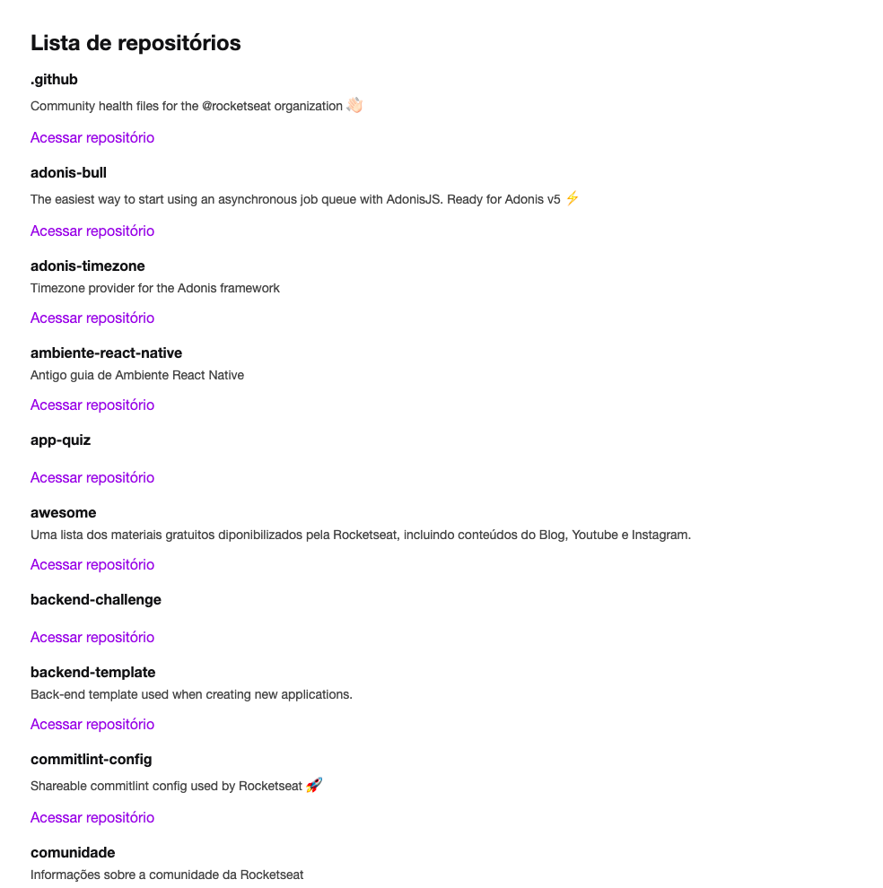

<h1 align="center">
  
  
</h1>

<p align="center">
  <a href="#-tecnologias">Tecnologias</a>&nbsp;&nbsp;&nbsp;|&nbsp;&nbsp;&nbsp;
  <a href="#-projeto">Projeto</a>&nbsp;&nbsp;&nbsp;|&nbsp;&nbsp;&nbsp;
  <a href="#-executando">Executando</a>&nbsp;&nbsp;&nbsp;|&nbsp;&nbsp;&nbsp;
  <a href="#memo-licença">Licença</a>
</p>

<p align="center">
 
 
</p>

<br>

<p align="center">
  
</p>

## 🚀 Tecnologias

Esse projeto foi desenvolvido com as seguintes tecnologias:

- [React](https://reactjs.org/)
- [Typescript](https://www.typescriptlang.org/)
- [React DOM](https://pt-br.reactjs.org/docs/react-dom.html)
- [React Refresh](https://www.npmjs.com/package/react-refresh)
- [Babel](https://babeljs.io/)
- [Cross Env](https://github.com/kentcdodds/cross-env#readme)
- [Sass](https://sass-lang.com/)
- [Node Sass](https://github.com/sass/node-sass)
- [CSS Loader](https://webpack.js.org/loaders/css-loader/)
- [Style Loader](https://webpack.js.org/loaders/style-loader/)
- [Webpack](https://webpack.js.org/)

## 💻 Projeto

<b>Github Explorer</b> é o primeiro projeto criado no chapter 1 da trilha de ReactJS do Ignite da [Rocketseat](https://github.com/Rocketseat). O projeto é para demonstrar a construção básica, do zero, de um projeto em React. No projeto é listado os repositórios da [Rocketseat](https://github.com/Rocketseat) utilizando a API do Github.

## 👷 Executando

```bash
# Clone o Repositório
$ https://github.com/matheusfalavigna/github-explorer.git
```

```bash
# Baixe as dependendências
$ yarn install
```

```bash
# Execute
$ yarn dev
```

<p>Acesse 
<a href="http://localhost:8080">http://localhost:8080</a> para ver o resultado.</p>

## 📝 Licença

Esse projeto está sob a licença MIT. Veja o arquivo [LICENSE](./.github/LICENSE.md) para mais detalhes.
